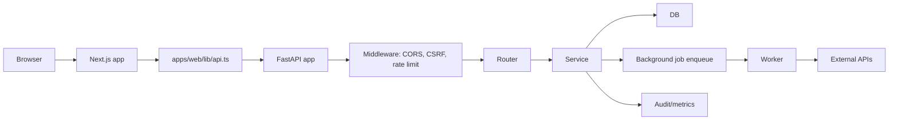
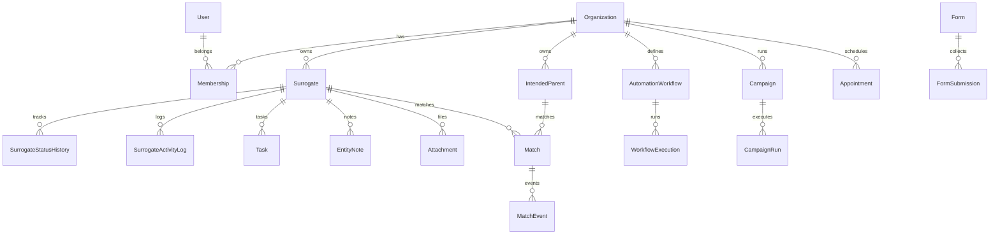
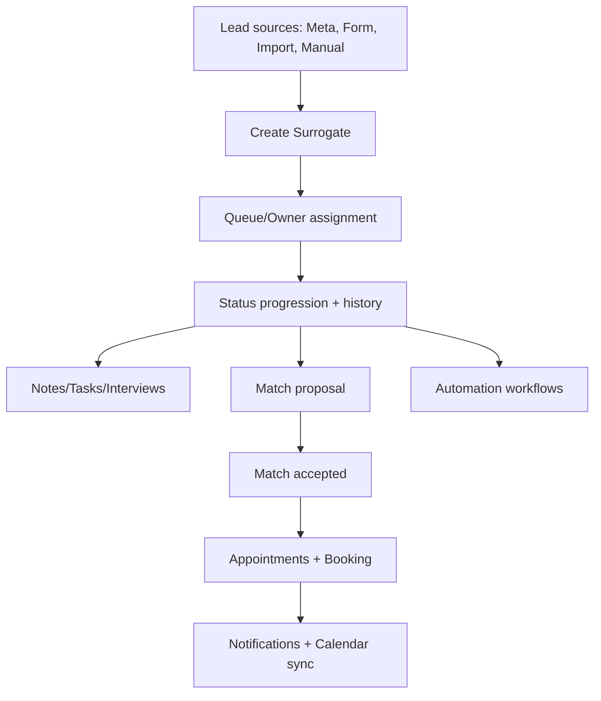

# CODEMAP

## Architecture Overview

### Runtime Topology
- Frontend: Next.js App Router in `apps/web` (SSR + client components) using cookie-based auth and a typed API client in `apps/web/lib/api.ts`.
- Backend: FastAPI app in `apps/api/app/main.py` with thin routers in `apps/api/app/routers` and business logic in `apps/api/app/services`.
- Background jobs: polling worker in `apps/api/app/worker.py` plus targeted jobs in `apps/api/app/jobs`.
- Database: PostgreSQL with SQLAlchemy 2.0 models in `apps/api/app/db/models.py` and Alembic migrations in `apps/api/alembic`.

### Key Request Flow (HTTP)
- Browser -> Next.js route -> `apps/web/lib/api.ts` (cookies + `X-Requested-With`) -> FastAPI middleware -> router -> service -> DB.
- Auth/session: `apps/api/app/core/deps.py` extracts session from cookie and enforces MFA/role/permissions.
- CSRF: enforced globally in `apps/api/app/main.py` middleware + per-route `require_csrf_header` in `apps/api/app/core/deps.py`.

### Background Work
- `apps/api/app/worker.py` polls the jobs table and executes integrations, exports, emails, workflows, AI, and import jobs.
- Scheduled triggers via `apps/api/app/routers/internal.py` (internal secret required) enqueue jobs.

---

## Directory Map (Purpose, Entry Points, Key Modules)

### Repo Root
- `README.md`: product overview and setup.
- `agents.md`: required rules and conventions (doc reference in README points to `docs/agents.md`, but this repo uses root `agents.md`).
- `CLAUDE.md`: contributor guidance (Claude/Codex usage).
- `CHANGELOG.md`: release history.
- `LAUNCH_READINESS.md`: launch gates and readiness audit (generated).
- `MODERNIZATION_AUDIT.md`: modernization findings and refactor plan (generated).
- `REVIEW.md`: ranked audit findings and redundancy map (generated).
- `ENTERPRISE_GAPS.md`: enterprise roadmap gaps (generated).
- `docker-compose.yml`: local Postgres.
- `release-please-config.json`: release automation configuration.
- `scripts/`: build-time utilities (e.g., `scripts/gen_stage_map.py`).
- `load-tests/`: performance scripts.
- `zap-baseline.conf`: ZAP baseline scan configuration.

### Backend: `apps/api`
- `apps/api/app/main.py`: FastAPI app, middleware, router registration, health endpoints.
- `apps/api/app/worker.py`: background worker loop for jobs.
- `apps/api/app/cli.py`: CLI utilities (e.g., org bootstrap).
- `apps/api/app/core/`: security, config, deps, RBAC, policies, rate limiting, telemetry, structured logging.
- `apps/api/app/db/`: SQLAlchemy models, enums, custom types, session.
- `apps/api/app/routers/`: API endpoints (thin); see API surface map below.
- `apps/api/app/services/`: business logic; org scoping and domain invariants are enforced here.
- `apps/api/app/schemas/`: Pydantic DTOs (request/response validation).
- `apps/api/app/utils/`: normalization, pagination, business-hours utilities.
- `apps/api/app/jobs/`: background jobs like attachment virus scanning.
- `apps/api/alembic/`: migration history.
- `apps/api/tests/`: pytest suite.

### Frontend: `apps/web`
- `apps/web/app/layout.tsx`: root layout and global providers.
- `apps/web/app/(app)/layout.tsx`: authenticated app shell with sidebar + AI drawer.
- `apps/web/app/(app)/*`: authenticated pages (dashboard, surrogates, matches, settings, etc).
- `apps/web/app/*`: public/auth pages (login, MFA, apply forms, booking, invites).
- `apps/web/components/`: shared components; `components/ui` contains shadcn/ui.
- `apps/web/lib/api.ts`: typed API client with CSRF header + cookie credentials.
- `apps/web/lib/api/*`: domain API functions.
- `apps/web/lib/hooks/*`: TanStack Query hooks per domain.
- `apps/web/lib/auth-context.tsx`: auth provider + auth guard.
- `apps/web/tests/`: Vitest unit/integration tests.

### Docs: `docs/`
- `docs/DESIGN.md`: backend architecture and feature design.
- `docs/backup-restore-runbook.md`: Postgres + storage backup/restore steps.
- `docs/automation.md`, `docs/oauth-setup-guide.md`, etc: domain-specific docs.

---

## Data Model Overview (Grouped by Domain + Invariant Enforcement)

### Auth / Org / RBAC
- Models: `Organization`, `User`, `Membership`, `RolePermission`, `UserPermissionOverride`, `AuthIdentity`, `UserSession`, `OrgInvite`.
- Invariants:
  - One org per user via `Membership` (enforced in services + DB constraints).
  - Role validation in `apps/api/app/core/deps.py`.
  - Permission checks in `apps/api/app/core/permissions.py` + `apps/api/app/services/permission_service.py`.

### Surrogates (Primary CRM Entity)
- Models: `Surrogate`, `SurrogateStatusHistory`, `SurrogateActivityLog`, `SurrogateContactAttempt`, `SurrogateImport`, `OrgCounter`.
- Invariants:
  - `organization_id` on every row, scoped in services.
  - Sequential surrogate_number via `OrgCounter` (service-level enforcement).
  - Status flow enforced in `apps/api/app/services/surrogate_service.py` and `apps/api/app/core/stage_rules.py`.

### Intended Parents
- Models: `IntendedParent`, `IntendedParentStatusHistory`.
- Invariants:
  - Org scoping in services.
  - Status transitions validated in service layer.

### Matches
- Models: `Match`, `MatchEvent`.
- Invariants:
  - One match links a surrogate and intended parent (service-level validation).
  - Status transitions enforced in `apps/api/app/services/match_service.py`.

### Tasks / Notes / Attachments
- Models: `Task`, `EntityNote`, `Attachment`.
- Invariants:
  - Ownership and permission checks in `apps/api/app/core/deps.py` + services.
  - Attachment storage and optional virus scanning in `apps/api/app/services/attachment_service.py` and `apps/api/app/jobs/scan_attachment.py`.

### Appointments / Scheduling
- Models: `AppointmentType`, `AvailabilityRule`, `AvailabilityOverride`, `BookingLink`, `Appointment`, `AppointmentEmailLog`.
- Invariants:
  - Org scoping and booking rules enforced in `apps/api/app/services/appointment_service.py`.

### Forms / Submissions
- Models: `Form`, `FormLogo`, `FormFieldMapping`, `FormSubmissionToken`, `FormSubmission`, `FormSubmissionFile`.
- Invariants:
  - Token-based public access for submissions in `apps/api/app/routers/forms_public.py`.
  - Field mapping and approval rules enforced in `apps/api/app/services/form_service.py`.

### Automation / Workflows
- Models: `AutomationWorkflow`, `WorkflowExecution`, `WorkflowTemplate`, `WorkflowResumeJob`, `UserWorkflowPreference`.
- Invariants:
  - Triggering and execution in `apps/api/app/services/workflow_engine.py` and `apps/api/app/services/workflow_triggers.py`.

### Campaigns / Email
- Models: `EmailTemplate`, `EmailLog`, `Campaign`, `CampaignRun`, `CampaignRecipient`, `EmailSuppression`, `CampaignTrackingEvent`.
- Invariants:
  - Send, suppression, and tracking rules in `apps/api/app/services/campaign_service.py` and `apps/api/app/services/email_service.py`.

### AI
- Models: `AISettings`, `AIConversation`, `AIMessage`, `AIActionApproval`, `AIEntitySummary`, `AIUsageLog`.
- Invariants:
  - Org opt-in and action approvals enforced in `apps/api/app/services/ai_*`.

### Integrations / Meta / Ops
- Models: `MetaLead`, `MetaPageMapping`, `MetaAdAccount`, `MetaCampaign`, `MetaAdSet`, `MetaAd`, `MetaDailySpend`, `MetaForm`, `MetaFormVersion`, `UserIntegration`, `ZoomMeeting`, `IntegrationHealth`, `IntegrationErrorRollup`, `SystemAlert`, `RequestMetricsRollup`, `AnalyticsSnapshot`.
- Invariants:
  - Token encryption in `apps/api/app/core/encryption.py` + `apps/api/app/db/types.py`.
  - Health and alerts in `apps/api/app/services/ops_service.py` and `apps/api/app/services/alert_service.py`.

### Compliance / Audit / Versioning
- Models: `AuditLog`, `LegalHold`, `DataRetentionPolicy`, `EntityVersion`.
- Invariants:
  - Audit hash chain enforced in `apps/api/app/services/audit_service.py`.
  - Retention enforcement in `apps/api/app/services/compliance_service.py`.

---

## API Surface Map (Routers, Endpoints, Dependencies)

Legend:
- Auth deps: `get_current_session` or `require_roles` (from `apps/api/app/core/deps.py`).
- RBAC deps: `require_permission` / `require_all_permissions` / `require_any_permissions`.
- CSRF deps: `require_csrf_header` for mutations.

### Auth
- Router: `apps/api/app/routers/auth.py` (prefix `/auth`)
- Deps: `get_current_session`, `require_csrf_header`.
- Endpoints:
  - GET `/auth/google/login`
  - GET `/auth/google/callback`
  - GET `/auth/me`
  - PATCH `/auth/me`
  - GET `/auth/me/sessions`
  - DELETE `/auth/me/sessions/{session_id}`
  - DELETE `/auth/me/sessions`
  - POST `/auth/me/avatar`
  - DELETE `/auth/me/avatar`
  - GET `/auth/me/signature`
  - PATCH `/auth/me/signature`
  - GET `/auth/me/signature/preview`
  - POST `/auth/me/signature/photo`
  - DELETE `/auth/me/signature/photo`
  - POST `/auth/logout`

### Surrogates
- Router: `apps/api/app/routers/surrogates.py` (prefix `/surrogates`)
- Deps: `get_current_session`, `require_permission`, `require_csrf_header`.
- Endpoints:
  - GET `/surrogates`
  - GET `/surrogates/stats`
  - GET `/surrogates/assignees`
  - POST `/surrogates`
  - PATCH `/surrogates/{surrogate_id}`
  - PATCH `/surrogates/{surrogate_id}/status`
  - PATCH `/surrogates/{surrogate_id}/assign`
  - POST `/surrogates/{surrogate_id}/archive`
  - POST `/surrogates/{surrogate_id}/restore`
  - DELETE `/surrogates/{surrogate_id}`
  - GET `/surrogates/{surrogate_id}`
  - GET `/surrogates/{surrogate_id}/history`
  - GET `/surrogates/{surrogate_id}/activity`
  - POST `/surrogates/{surrogate_id}/contact-attempts`
  - GET `/surrogates/{surrogate_id}/contact-attempts`
  - POST `/surrogates/{surrogate_id}/send-email`
  - POST `/surrogates/bulk-assign`
  - GET `/surrogates/claim-queue`
  - POST `/surrogates/import/preview`
  - POST `/surrogates/import/confirm`
  - GET `/surrogates/import`
  - GET `/surrogates/import/{import_id}`

### Intended Parents
- Router: `apps/api/app/routers/intended_parents.py` (prefix `/intended-parents`)
- Deps: `get_current_session`, `require_permission`, `require_csrf_header`.
- Endpoints:
  - GET `/intended-parents`
  - GET `/intended-parents/stats`
  - POST `/intended-parents`
  - GET `/intended-parents/{ip_id}`
  - PATCH `/intended-parents/{ip_id}`
  - PATCH `/intended-parents/{ip_id}/status`
  - POST `/intended-parents/{ip_id}/archive`
  - POST `/intended-parents/{ip_id}/restore`
  - DELETE `/intended-parents/{ip_id}`
  - GET `/intended-parents/{ip_id}/history`
  - GET `/intended-parents/{ip_id}/notes`
  - POST `/intended-parents/{ip_id}/notes`
  - DELETE `/intended-parents/{ip_id}/notes/{note_id}`

### Matches
- Router: `apps/api/app/routers/matches.py` (prefix `/matches`)
- Deps: `get_current_session`, `require_permission`, `require_csrf_header`.
- Endpoints:
  - GET `/matches`
  - POST `/matches`
  - GET `/matches/stats`
  - GET `/matches/{match_id}`
  - PUT `/matches/{match_id}/accept`
  - PUT `/matches/{match_id}/reject`
  - DELETE `/matches/{match_id}`
  - PATCH `/matches/{match_id}/notes`
  - GET `/matches/{match_id}/events`
  - POST `/matches/{match_id}/events`
  - GET `/matches/{match_id}/events/{event_id}`
  - PUT `/matches/{match_id}/events/{event_id}`
  - DELETE `/matches/{match_id}/events/{event_id}`

### Tasks
- Router: `apps/api/app/routers/tasks.py` (prefix `/tasks`)
- Deps: `get_current_session`, `require_permission`, `require_csrf_header`.
- Endpoints:
  - GET `/tasks`
  - POST `/tasks`
  - GET `/tasks/{task_id}`
  - PATCH `/tasks/{task_id}`
  - POST `/tasks/{task_id}/complete`
  - POST `/tasks/{task_id}/uncomplete`
  - POST `/tasks/bulk-complete`
  - DELETE `/tasks/{task_id}`
  - POST `/tasks/{task_id}/resolve`

### Notes
- Router: `apps/api/app/routers/notes.py` (no router prefix)
- Deps: `get_current_session`, `require_permission`, `require_csrf_header`.
- Endpoints:
  - GET `/surrogates/{surrogate_id}/notes`
  - POST `/surrogates/{surrogate_id}/notes`
  - DELETE `/notes/{note_id}`

### Interviews
- Router: `apps/api/app/routers/interviews.py` (no router prefix)
- Deps: `get_current_session`, `require_permission`, `require_csrf_header`.
- Endpoints:
  - GET `/surrogates/{surrogate_id}/interviews`
  - POST `/surrogates/{surrogate_id}/interviews`
  - GET `/interviews/{interview_id}`
  - PATCH `/interviews/{interview_id}`
  - DELETE `/interviews/{interview_id}`
  - GET `/interviews/{interview_id}/versions`
  - GET `/interviews/{interview_id}/versions/{version}`
  - GET `/interviews/{interview_id}/versions/diff`
  - POST `/interviews/{interview_id}/versions/{version}/restore`
  - GET `/interviews/{interview_id}/notes`
  - POST `/interviews/{interview_id}/notes`
  - PATCH `/interviews/{interview_id}/notes/{note_id}`
  - DELETE `/interviews/{interview_id}/notes/{note_id}`
  - POST `/interviews/{interview_id}/notes/{note_id}/resolve`
  - POST `/interviews/{interview_id}/notes/{note_id}/unresolve`
  - GET `/interviews/{interview_id}/attachments`
  - POST `/interviews/{interview_id}/attachments`
  - POST `/interviews/{interview_id}/attachments/{attachment_id}/link`
  - DELETE `/interviews/{interview_id}/attachments/{attachment_id}`
  - POST `/interviews/{interview_id}/attachments/{attachment_id}/transcribe`
  - GET `/interviews/{interview_id}/attachments/{attachment_id}/transcription`
  - POST `/interviews/{interview_id}/ai/summarize`
  - POST `/surrogates/{surrogate_id}/interviews/ai/summarize-all`
  - GET `/interviews/{interview_id}/export`
  - GET `/surrogates/{surrogate_id}/interviews/export`

### Attachments
- Router: `apps/api/app/routers/attachments.py` (prefix `/attachments`)
- Deps: `require_permission` / `require_any_permissions`, `require_csrf_header`.
- Endpoints:
  - POST `/attachments/surrogates/{surrogate_id}/attachments`
  - GET `/attachments/surrogates/{surrogate_id}/attachments`
  - GET `/attachments/intended-parents/{ip_id}/attachments`
  - POST `/attachments/intended-parents/{ip_id}/attachments`
  - GET `/attachments/{attachment_id}/download`
  - DELETE `/attachments/{attachment_id}`
  - GET `/attachments/local/{storage_key:path}`

### Appointments / Booking
- Router: `apps/api/app/routers/appointments.py` (prefix `/appointments`)
- Deps: `get_current_session`, `require_permission`, `require_csrf_header`.
- Endpoints:
  - GET `/appointments`
  - GET `/appointments/{appointment_id}`
  - GET `/appointments/types`
  - POST `/appointments/types`
  - PATCH `/appointments/types/{type_id}`
  - DELETE `/appointments/types/{type_id}`
  - GET `/appointments/availability`
  - PUT `/appointments/availability`
  - GET `/appointments/overrides`
  - POST `/appointments/overrides`
  - DELETE `/appointments/overrides/{override_id}`
  - GET `/appointments/booking-link`
  - POST `/appointments/booking-link/regenerate`
  - GET `/appointments/booking-preview`
  - GET `/appointments/booking-preview/slots`
  - PATCH `/appointments/{appointment_id}/link`
  - POST `/appointments/{appointment_id}/approve`
  - POST `/appointments/{appointment_id}/reschedule`
  - POST `/appointments/{appointment_id}/cancel`
- Public booking router: `apps/api/app/routers/booking.py` (prefix `/book`)
  - GET `/book/{public_slug}`
  - GET `/book/{public_slug}/slots`
  - POST `/book/{public_slug}/book`
  - GET `/book/self-service/{org_id}/reschedule/{token}`
  - GET `/book/self-service/{org_id}/reschedule/{token}/slots`
  - POST `/book/self-service/{org_id}/reschedule/{token}`
  - GET `/book/self-service/{org_id}/cancel/{token}`
  - POST `/book/self-service/{org_id}/cancel/{token}`

### Forms
- Router: `apps/api/app/routers/forms.py` (prefix `/forms`)
- Deps: `get_current_session`, `require_permission`, `require_csrf_header`.
- Endpoints:
  - GET `/forms`
  - POST `/forms`
  - GET `/forms/{form_id}`
  - PATCH `/forms/{form_id}`
  - POST `/forms/logos`
  - POST `/forms/{form_id}/publish`
  - GET `/forms/{form_id}/mappings`
  - PUT `/forms/{form_id}/mappings`
  - POST `/forms/{form_id}/tokens`
  - GET `/forms/{form_id}/surrogates/{surrogate_id}/submission`
  - GET `/forms/{form_id}/submissions`
  - POST `/forms/submissions/{submission_id}/approve`
  - POST `/forms/submissions/{submission_id}/reject`
  - PATCH `/forms/submissions/{submission_id}/answers`
  - POST `/forms/submissions/{submission_id}/files`
  - GET `/forms/submissions/{submission_id}/files/{file_id}/download`
  - DELETE `/forms/submissions/{submission_id}/files/{file_id}`
  - GET `/forms/submissions/{submission_id}/export`
- Public forms router: `apps/api/app/routers/forms_public.py` (prefix `/forms/public`)
  - GET `/forms/public/{org_id}/logos/{logo_id}`
  - GET `/forms/public/{token}`
  - POST `/forms/public/{token}/submit`

### Automation / Workflows / Templates
- Router: `apps/api/app/routers/workflows.py` (prefix `/workflows`)
- Deps: `get_current_session`, `require_permission`, `require_csrf_header`.
- Endpoints:
  - GET `/workflows`
  - GET `/workflows/options`
  - GET `/workflows/stats`
  - GET `/workflows/executions`
  - GET `/workflows/executions/stats`
  - POST `/workflows`
  - GET `/workflows/{workflow_id}`
  - PATCH `/workflows/{workflow_id}`
  - DELETE `/workflows/{workflow_id}`
  - POST `/workflows/{workflow_id}/toggle`
  - POST `/workflows/{workflow_id}/duplicate`
  - POST `/workflows/{workflow_id}/test`
  - GET `/workflows/{workflow_id}/executions`
  - GET `/workflows/me/preferences`
  - PATCH `/workflows/me/preferences/{workflow_id}`
- Router: `apps/api/app/routers/templates.py` (prefix `/templates`)
  - GET `/templates`
  - GET `/templates/categories`
  - GET `/templates/{template_id}`
  - POST `/templates`
  - POST `/templates/from-workflow`
  - POST `/templates/{template_id}/use`
  - DELETE `/templates/{template_id}`

### Campaigns / Email Templates / Tracking
- Router: `apps/api/app/routers/campaigns.py` (prefix `/campaigns`)
- Deps: `get_current_session`, `require_permission`, `require_csrf_header`.
- Endpoints:
  - GET `/campaigns`
  - POST `/campaigns`
  - GET `/campaigns/{campaign_id}`
  - PATCH `/campaigns/{campaign_id}`
  - DELETE `/campaigns/{campaign_id}`
  - POST `/campaigns/preview-filters`
  - GET `/campaigns/{campaign_id}/preview`
  - POST `/campaigns/{campaign_id}/send`
  - POST `/campaigns/{campaign_id}/cancel`
  - GET `/campaigns/{campaign_id}/runs`
  - GET `/campaigns/{campaign_id}/runs/{run_id}`
  - GET `/campaigns/{campaign_id}/runs/{run_id}/recipients`
  - GET `/campaigns/suppressions`
  - POST `/campaigns/suppressions`
  - DELETE `/campaigns/suppressions/{email}`
- Router: `apps/api/app/routers/email_templates.py` (prefix `/email-templates`)
  - GET `/email-templates`
  - POST `/email-templates`
  - GET `/email-templates/{template_id}`
  - PATCH `/email-templates/{template_id}`
  - DELETE `/email-templates/{template_id}`
  - POST `/email-templates/send`
  - GET `/email-templates/{template_id}/versions`
  - POST `/email-templates/{template_id}/rollback`
- Router: `apps/api/app/routers/tracking.py` (prefix `/tracking`)
  - GET `/tracking/open/{token}`
  - GET `/tracking/click/{token}`

### AI
- Router: `apps/api/app/routers/ai.py` (prefix `/ai`)
- Deps: `require_permission`, `require_all_permissions`, `require_csrf_header`.
- Endpoints:
  - GET `/ai/settings`
  - PATCH `/ai/settings`
  - POST `/ai/settings/test`
  - GET `/ai/consent`
  - POST `/ai/consent/accept`
  - POST `/ai/chat`
  - POST `/ai/chat/async`
  - GET `/ai/chat/jobs/{job_id}`
  - GET `/ai/conversations/{entity_type}/{entity_id}`
  - GET `/ai/conversations/global`
  - GET `/ai/conversations/{entity_type}/{entity_id}/all`
  - POST `/ai/actions/{approval_id}/approve`
  - POST `/ai/actions/{approval_id}/reject`
  - GET `/ai/actions/pending`
  - GET `/ai/usage/summary`
  - GET `/ai/usage/by-model`
  - GET `/ai/usage/daily`
  - GET `/ai/usage/top-users`
  - GET `/ai/usage/me`
  - POST `/ai/summarize-surrogate`
  - POST `/ai/draft-email`
  - POST `/ai/analyze-dashboard`
  - POST `/ai/workflows/generate`
  - POST `/ai/workflows/validate`
  - POST `/ai/workflows/save`
  - POST `/ai/parse-schedule`
  - POST `/ai/create-bulk-tasks`

### Search / Analytics / Dashboard / Ops
- Router: `apps/api/app/routers/search.py` (prefix `/search`)
  - GET `/search`
- Router: `apps/api/app/routers/analytics.py` (prefix `/analytics`)
  - GET `/analytics/summary`
  - GET `/analytics/surrogates/by-status`
  - GET `/analytics/surrogates/by-assignee`
  - GET `/analytics/surrogates/trend`
  - GET `/analytics/surrogates/by-state`
  - GET `/analytics/surrogates/by-source`
  - GET `/analytics/funnel`
  - GET `/analytics/kpis`
  - GET `/analytics/campaigns`
  - GET `/analytics/funnel/compare`
  - GET `/analytics/surrogates/by-state/compare`
  - GET `/analytics/performance/by-user`
  - GET `/analytics/activity-feed`
  - GET `/analytics/export/pdf`
  - GET `/analytics/meta/performance`
  - GET `/analytics/meta/ad-accounts`
  - GET `/analytics/meta/spend/totals`
  - GET `/analytics/meta/spend/by-campaign`
  - GET `/analytics/meta/spend/by-breakdown`
  - GET `/analytics/meta/spend/trend`
  - GET `/analytics/meta/forms`
  - GET `/analytics/meta/campaigns`
- Router: `apps/api/app/routers/dashboard.py` (prefix `/dashboard`)
  - GET `/dashboard/upcoming`
- Router: `apps/api/app/routers/ops.py` (prefix `/ops`)
  - GET `/ops/health`
  - GET `/ops/alerts/summary`
  - GET `/ops/alerts`
  - GET `/ops/sli`
  - POST `/ops/alerts/{alert_id}/resolve`
  - POST `/ops/alerts/{alert_id}/acknowledge`
  - POST `/ops/alerts/{alert_id}/snooze`

### Notifications / WebSocket
- Router: `apps/api/app/routers/notifications.py` (prefix `/me`)
  - GET `/me/notifications`
  - GET `/me/notifications/count`
  - PATCH `/me/notifications/{notification_id}/read`
  - POST `/me/notifications/read-all`
  - GET `/me/settings/notifications`
  - PATCH `/me/settings/notifications`
- Router: `apps/api/app/routers/websocket.py` (prefix `/ws`)
  - WS `/ws/notifications`

### Settings / Permissions / Pipelines / Queues / Invites
- Router: `apps/api/app/routers/settings.py` (prefix `/settings`)
  - GET `/settings/organization`
  - PATCH `/settings/organization`
  - GET `/settings/organization/signature`
  - PATCH `/settings/organization/signature`
  - GET `/settings/organization/signature/preview`
  - POST `/settings/organization/signature/logo`
  - DELETE `/settings/organization/signature/logo`
- Router: `apps/api/app/routers/permissions.py` (prefix `/settings/permissions`)
  - GET `/settings/permissions/available`
  - GET `/settings/permissions/members`
  - GET `/settings/permissions/members/{member_id}`
  - PATCH `/settings/permissions/members/{member_id}`
  - DELETE `/settings/permissions/members/{member_id}`
  - GET `/settings/permissions/effective/{user_id}`
  - GET `/settings/permissions/roles`
  - GET `/settings/permissions/roles/{role}`
  - PATCH `/settings/permissions/roles/{role}`
- Router: `apps/api/app/routers/pipelines.py` (prefix `/settings/pipelines`)
  - GET `/settings/pipelines`
  - GET `/settings/pipelines/default`
  - GET `/settings/pipelines/{pipeline_id}`
  - POST `/settings/pipelines`
  - POST `/settings/pipelines/default/sync-stages`
  - PATCH `/settings/pipelines/{pipeline_id}`
  - DELETE `/settings/pipelines/{pipeline_id}`
  - GET `/settings/pipelines/{pipeline_id}/versions`
  - POST `/settings/pipelines/{pipeline_id}/rollback`
  - GET `/settings/pipelines/{pipeline_id}/stages`
  - POST `/settings/pipelines/{pipeline_id}/stages`
  - PUT `/settings/pipelines/{pipeline_id}/stages/reorder`
  - PUT `/settings/pipelines/{pipeline_id}/stages/{stage_id}`
  - DELETE `/settings/pipelines/{pipeline_id}/stages/{stage_id}`
- Router: `apps/api/app/routers/queues.py` (prefix `/queues`)
  - GET `/queues`
  - GET `/queues/{queue_id}`
  - POST `/queues`
  - PATCH `/queues/{queue_id}`
  - DELETE `/queues/{queue_id}`
  - POST `/queues/surrogates/{surrogate_id}/claim`
  - POST `/queues/surrogates/{surrogate_id}/release`
  - POST `/queues/surrogates/{surrogate_id}/assign`
  - GET `/queues/{queue_id}/members`
  - POST `/queues/{queue_id}/members`
  - DELETE `/queues/{queue_id}/members/{user_id}`
- Router: `apps/api/app/routers/invites.py` (prefix `/settings/invites`)
  - GET `/settings/invites`
  - POST `/settings/invites`
  - POST `/settings/invites/{invite_id}/resend`
  - DELETE `/settings/invites/{invite_id}`
  - GET `/settings/invites/accept/{invite_id}`
  - POST `/settings/invites/accept/{invite_id}`

### Compliance / Audit
- Router: `apps/api/app/routers/compliance.py` (prefix `/compliance`)
  - GET `/compliance/policies`
  - POST `/compliance/policies`
  - GET `/compliance/legal-holds`
  - POST `/compliance/legal-holds`
  - POST `/compliance/legal-holds/{hold_id}/release`
  - GET `/compliance/purge-preview`
  - POST `/compliance/purge-execute`
- Router: `apps/api/app/routers/audit.py` (prefix `/audit`)
  - GET `/audit`
  - GET `/audit/event-types`
  - GET `/audit/ai-activity`
  - GET `/audit/exports`
  - POST `/audit/exports`
  - GET `/audit/exports/{export_id}`
  - GET `/audit/exports/{export_id}/download`

### Admin / Dev / Jobs / Internal
- Router: `apps/api/app/routers/admin_exports.py` (prefix `/admin/exports`)
  - POST `/admin/exports/surrogates`
  - POST `/admin/exports/config`
  - POST `/admin/exports/analytics`
  - GET `/admin/exports/jobs/{job_id}`
  - GET `/admin/exports/jobs/{job_id}/download`
  - GET `/admin/exports/jobs/{job_id}/file`
- Router: `apps/api/app/routers/admin_imports.py` (prefix `/admin/imports`)
  - POST `/admin/imports/all`
  - POST `/admin/imports/config`
  - POST `/admin/imports/surrogates`
- Router: `apps/api/app/routers/admin_meta.py` (prefix `/admin/meta-pages`)
  - GET `/admin/meta-pages`
  - POST `/admin/meta-pages`
  - PUT `/admin/meta-pages/{page_id}`
  - DELETE `/admin/meta-pages/{page_id}`
- Router: `apps/api/app/routers/admin_versions.py` (prefix `/admin/versions`)
  - GET `/admin/versions/{entity_type}/{entity_id}`
  - GET `/admin/versions/{entity_type}/{entity_id}/{version}`
- Router: `apps/api/app/routers/dev.py` (prefix `/dev`, only in dev)
  - POST `/dev/seed`
  - POST `/dev/login-as/{user_id}`
  - GET `/dev/meta-leads/alerts`
  - GET `/dev/meta-leads/all`
  - POST `/dev/seed-templates`
  - POST `/dev/seed-templates/{org_id}`
- Router: `apps/api/app/routers/jobs.py` (prefix `/jobs`)
  - GET `/jobs`
  - GET `/jobs/{job_id}`
- Router: `apps/api/app/routers/internal.py` (prefix `/internal/scheduled`, internal secret required)
  - POST `/internal/scheduled/token-check`
  - POST `/internal/scheduled/workflow-sweep`
  - POST `/internal/scheduled/workflow-approval-expiry`
  - POST `/internal/scheduled/data-purge`
  - POST `/internal/scheduled/task-notifications`
  - POST `/internal/scheduled/meta-hierarchy-sync`
  - POST `/internal/scheduled/meta-spend-sync`
  - POST `/internal/scheduled/meta-forms-sync`

### Integrations
- Router: `apps/api/app/routers/integrations.py` (prefix `/integrations`)
  - GET `/integrations`
  - DELETE `/integrations/{integration_type}`
  - GET `/integrations/gmail/connect`
  - GET `/integrations/gmail/callback`
  - GET `/integrations/gmail/status`
  - GET `/integrations/google/calendar/events`
  - GET `/integrations/zoom/connect`
  - GET `/integrations/zoom/callback`
  - GET `/integrations/zoom/status`
  - GET `/integrations/zoom/meetings`
  - POST `/integrations/zoom/meetings`
  - POST `/integrations/zoom/send-invite`
- Router: `apps/api/app/routers/webhooks.py` (prefix `/webhooks`)
  - GET `/webhooks/meta`
  - POST `/webhooks/meta`
  - POST `/webhooks/meta/simulate`

### Metadata / MFA / Status Changes
- Router: `apps/api/app/routers/metadata.py` (prefix `/metadata`)
  - GET `/metadata/statuses`
  - GET `/metadata/sources`
  - GET `/metadata/task-types`
  - GET `/metadata/intended-parent-statuses`
  - GET `/metadata/roles`
- Router: `apps/api/app/routers/mfa.py` (prefix `/mfa`)
  - GET `/mfa/status`
  - POST `/mfa/totp/setup`
  - POST `/mfa/totp/verify`
  - POST `/mfa/recovery/regenerate`
  - POST `/mfa/verify`
  - POST `/mfa/complete`
  - POST `/mfa/disable`
  - GET `/mfa/duo/status`
  - GET `/mfa/duo/health`
  - POST `/mfa/duo/initiate`
  - POST `/mfa/duo/callback`
- Router: `apps/api/app/routers/status_change_requests.py` (prefix `/status-change-requests`)
  - GET `/status-change-requests`
  - GET `/status-change-requests/{request_id}`
  - POST `/status-change-requests/{request_id}/approve`
  - POST `/status-change-requests/{request_id}/reject`
  - POST `/status-change-requests/{request_id}/cancel`

### Surrogate Profile
- Router: `apps/api/app/routers/profile.py` (prefix `/surrogates`)
  - GET `/surrogates/{surrogate_id}/profile`
  - POST `/surrogates/{surrogate_id}/profile/sync`
  - PUT `/surrogates/{surrogate_id}/profile/overrides`
  - POST `/surrogates/{surrogate_id}/profile/hidden`
  - GET `/surrogates/{surrogate_id}/profile/export`

---

## Cross-Cutting Concerns
- Auth + Sessions: `apps/api/app/core/security.py`, `apps/api/app/core/deps.py`, `apps/api/app/services/session_service.py`.
- RBAC + Policies: `apps/api/app/core/permissions.py`, `apps/api/app/core/policies.py`, `apps/api/app/services/permission_service.py`.
- CSRF: `apps/api/app/core/deps.py` + middleware in `apps/api/app/main.py`.
- Multi-tenancy: `organization_id` on all models in `apps/api/app/db/models.py`; scoping via `get_current_session` + service filters.
- Encryption/PII: `apps/api/app/core/encryption.py`, `apps/api/app/db/types.py`, `apps/api/app/services/pii_anonymizer.py`.
- Audit logging: `apps/api/app/services/audit_service.py` + `AuditLog` model.
- Observability: `apps/api/app/core/structured_logging.py`, `apps/api/app/core/telemetry.py`, `apps/api/app/core/gcp_monitoring.py`, metrics in `apps/api/app/services/metrics_service.py`.
- Rate limiting: `apps/api/app/core/rate_limit.py` + `slowapi` in `apps/api/app/main.py`.
- WebSockets: `apps/api/app/core/websocket.py`, `apps/api/app/routers/websocket.py`.
- Integrations: `apps/api/app/services/google_oauth.py`, `apps/api/app/services/gmail_service.py`, `apps/api/app/services/zoom_service.py`, `apps/api/app/services/meta_*`.

---

## Diagrams (Mermaid)

### Request Lifecycle

### Domain Relationships (Core)

### Workflow: Surrogate Intake -> Match -> Scheduling

---

## Where To Change X (Maintainer Index)

- Add a new entity:
  - Model: `apps/api/app/db/models.py`
  - Schema: `apps/api/app/schemas/*.py`
  - Service: `apps/api/app/services/*.py`
  - Router: `apps/api/app/routers/*.py`
  - Migration: `apps/api/alembic/versions/*`
  - Frontend types + API: `apps/web/lib/types/*`, `apps/web/lib/api/*`, `apps/web/lib/hooks/*`

- Add a new endpoint:
  - Router: `apps/api/app/routers/*.py`
  - Permissions: `apps/api/app/core/policies.py` or `apps/api/app/core/permissions.py`
  - Service: `apps/api/app/services/*.py`
  - Frontend integration: `apps/web/lib/api/*` + `apps/web/lib/hooks/*`

- Add a workflow trigger or action:
  - Triggers: `apps/api/app/services/workflow_triggers.py`
  - Engine: `apps/api/app/services/workflow_engine.py`
  - Router: `apps/api/app/routers/workflows.py`
  - UI: `apps/web/app/(app)/automation/*`, `apps/web/components/automation/*`

- Add a background job:
  - Job type enum: `apps/api/app/db/enums.py`
  - Scheduler: `apps/api/app/services/job_service.py`
  - Worker: `apps/api/app/worker.py`
  - Internal schedule (optional): `apps/api/app/routers/internal.py`

- Add a new integration:
  - Service: `apps/api/app/services/*_service.py`
  - Router: `apps/api/app/routers/integrations.py` or `apps/api/app/routers/webhooks.py`
  - Models: `apps/api/app/db/models.py`
  - UI: `apps/web/app/(app)/settings/integrations`, `apps/web/lib/api/integrations.ts`

- Change pipeline stages:
  - Backend definitions: `apps/api/app/core/stage_definitions.py`, `apps/api/app/core/stage_rules.py`
  - Frontend constants: `apps/web/lib/constants/*`
  - Generator: `scripts/gen_stage_map.py`

- Update auth/session behavior:
  - Backend: `apps/api/app/core/security.py`, `apps/api/app/core/deps.py`, `apps/api/app/services/session_service.py`
  - Frontend: `apps/web/lib/auth-context.tsx`

- Update AI behavior:
  - Backend: `apps/api/app/services/ai_*`, `apps/api/app/routers/ai.py`
  - Frontend: `apps/web/components/ai/*`, `apps/web/app/(app)/ai-assistant`
