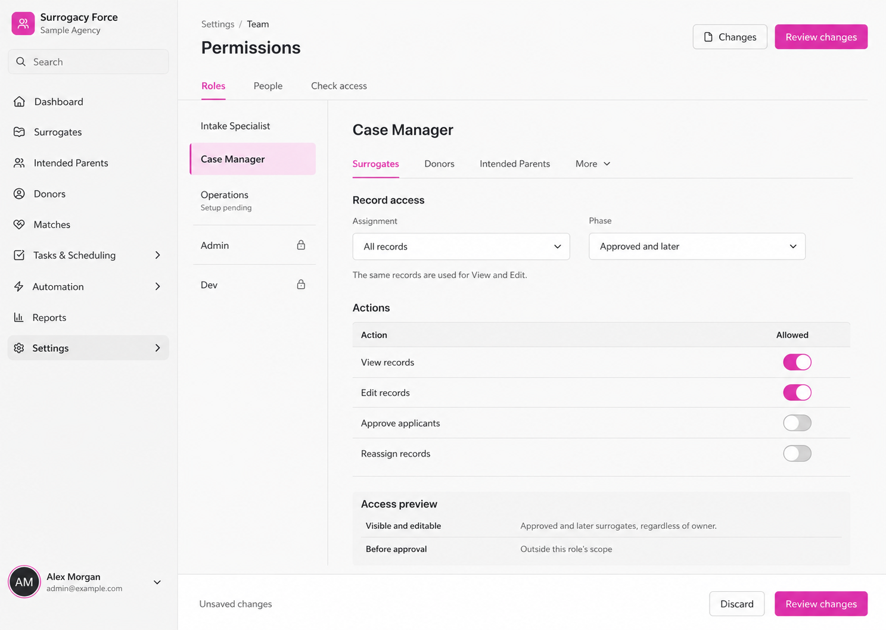
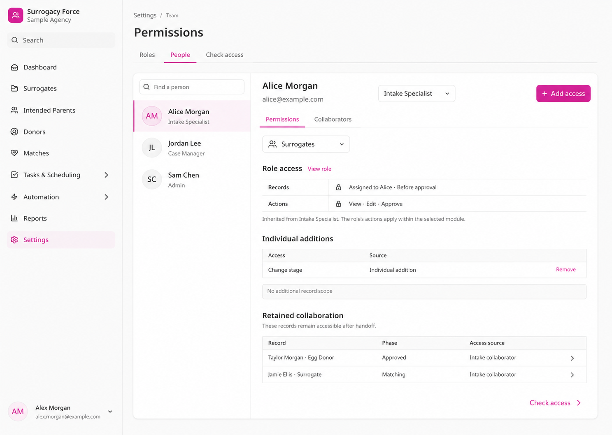
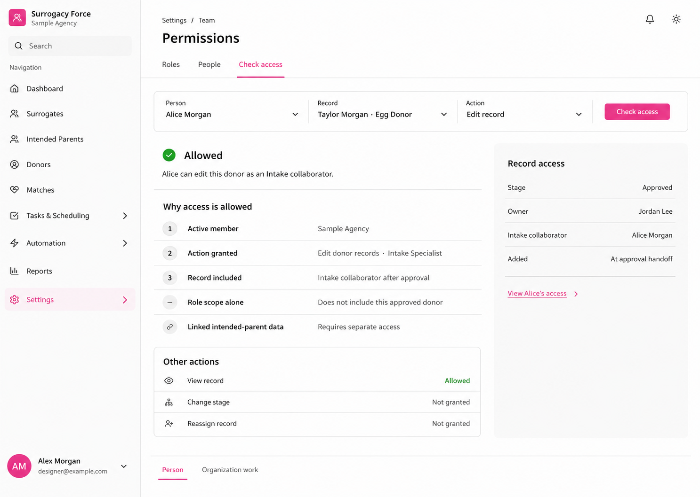

# Permission UI mock-ups

Status: visual concepts awaiting feedback. Built-in Image Gen outputs with synthetic people and records; no application changes.

## 1. Roles

[Full image](01-roles.png)

Module scope appears above actions. Admin and Dev are protected. Operations shows Setup pending. The illustrated switches are a sample configuration, not a complete default-permission specification.

## 2. People

[Full image](02-people.png)

Inherited access, individual additions, and retained collaboration appear separately. The Surrogates selector applies to the role and addition sections; the collaboration list illustrates relationships across modules. A refinement should make that distinction explicit.

Alice has a surrogate stage-change addition in this example.

## 3. Check access

[Full image](03-check-access.png)

The result explains both the granted action and the record-access route. Alice can edit the approved donor through Intake collaboration. She has no donor stage-change addition in this example. Linked intended-parent access remains separate.

## Open design work

- Confirm the navigation and preferred screen structure.
- Show adding record scope, reviewing changes, role changes, and collaborator removal.
- Show personal versus organization authority in workflow, campaign, and template controls.
- Define Operations defaults.
- Verify responsive layouts, interaction states, and keyboard behavior during implementation.

[Permission model](../../permission-system-design.md) · [Generation prompts](prompts.md)
