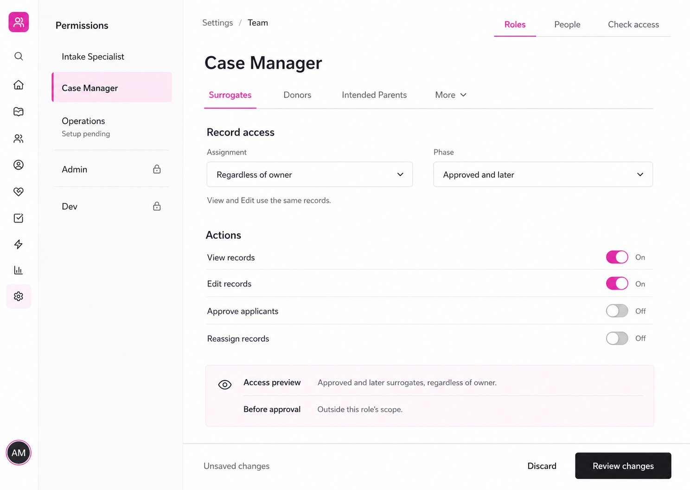
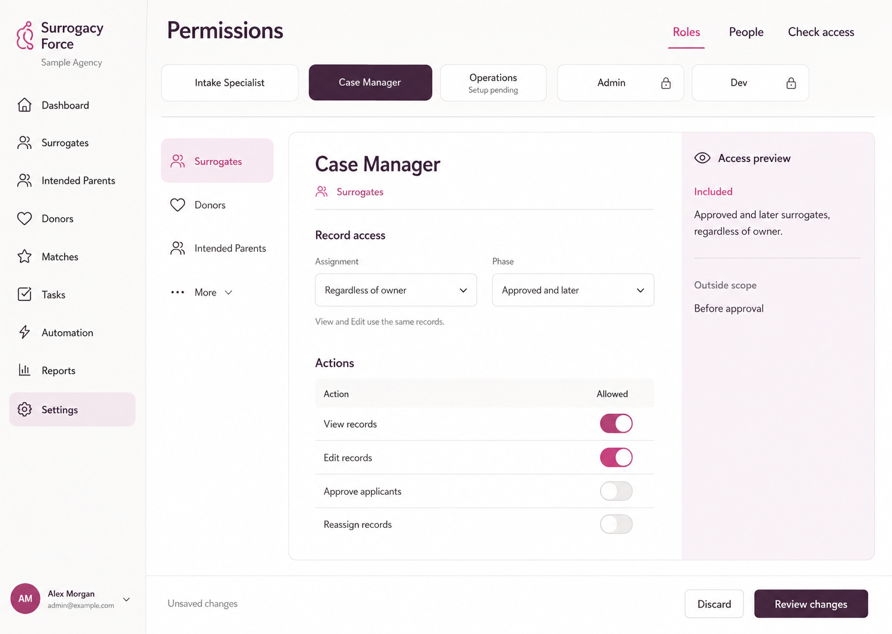
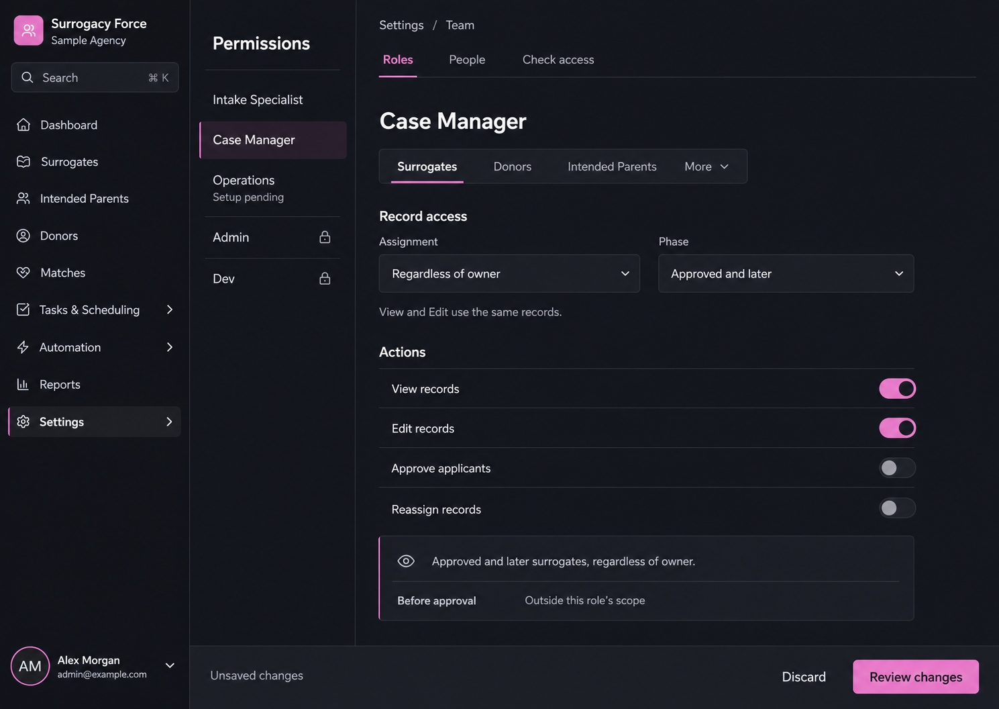

# Role editor visual variants

Status: variant 2 selected. The user preferred its warm palette, horizontal role chooser, and side access preview. These are static Image Gen concepts; implementation and remaining permission screens are subsequent work.

| Variant | Direction | Trade-off |
|---|---|---|
| [1](01-precision.png) | Bright surface, compact global navigation, vertical role list | More editor space; icon-only global navigation needs accessible names and tooltips |
| [2](02-studio.png) | Warm palette, horizontal role chooser, side access preview | Clear separation of role and module; the horizontal chooser needs responsive adaptation |
| [3](03-graphite.png) | Dark surfaces, vertical role list, rose accents | Strong focus; a matching light theme and measured contrast remain implementation work |

## 1

## 2

## 3

## Shared behavior

- Case Manager is selected; Operations remains Setup pending.
- Assignment and phase jointly define record scope.
- View and Edit use that scope; actions remain separately configurable.
- Admin and Dev baselines are protected.
- Switch values are sample settings, not a final default matrix.
- Review changes opens the configuration diff, not a second-person approval process.
- Existing product logos and icons should supply implementation assets; generated imagery is a visual concept.

[Original concepts](../README.md) · [Generation prompts](prompts.md)
