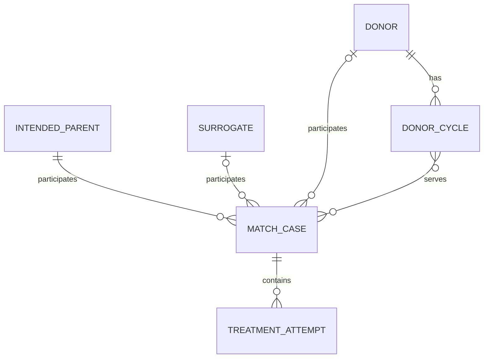

# Independent match cases and shared integrations

Planning baseline: `df83c0ad`, September 5, 2026. Repository audit only; production state and data distribution have not been inspected. This document records the broader plan. The approved screen scope is implemented locally; AI, SMS, donor-cycle sharing, and clinical-progress ownership remain future work. Deployment is not authorized.

## Confirmed product rules

- Each match is an independent case with exactly one IP and either one surrogate or one donor. Cases have their own start dates and lifecycle, including when an IP has several cases at different times. There is no parent IP-journey entity.
- IPs and donors may have multiple confirmed active matches concurrently.
- A surrogate may have overlapping proposals but only one confirmed active match at a time.
- Multiple treatment attempts may belong to a continuing match. Restarting an ended relationship creates a new match, even for the same participants.
- One donor retrieval/collection may serve multiple IP matches. Store one donor-owned cycle with explicit match associations.
- SMS uses organization-owned sending, with admin-only setup analogous to organization email configuration. Automated transactional SMS is in scope; a staff conversation inbox is not a first-release requirement.
- Donor, surrogate, and IP records remain distinct. Donor and IP pages retain light layouts. Match cases retain the existing side-by-side party profiles and combined work on one page.
- Existing production records, links, history, and in-flight operations must survive the transition.

Terminology: [CONTEXT.md](../CONTEXT.md).

## Current constraints and consequences

| Current behavior | Consequence | Source |
|---|---|---|
| Lifetime uniqueness of an organization/surrogate/IP pair | A cancelled or rejected pair cannot receive a new match | `apps/api/app/db/models/matches.py:35` |
| One `accepted` match per surrogate; no equivalent IP limit | Several surrogates per IP already work structurally; cancellation pending needs to retain the surrogate commitment | `apps/api/app/db/models/matches.py:48` |
| No completed match state | Finishing a relationship cannot be represented separately from cancelling it | `apps/api/app/core/match_status_definitions.py:32` |
| Accepting/cancelling a match changes participant pipeline stages | Cancelling one match can reset an IP that has another active match | `apps/api/app/services/match_service.py:519`; `apps/api/app/services/status_change_request_service.py:290` |
| Acceptance calls a stage operation that commits internally | Match, stage, proposal changes, and activity need one transaction owner | `apps/api/app/services/surrogate_status_service.py:742` |
| Task creation accepts `match_id` but stores only participant IDs | Task history cannot distinguish repeated matches | `apps/api/app/routers/tasks.py:151`; `apps/api/app/db/models/tasks.py:102` |
| Match appointment queries combine surrogate OR IP links | Another relationship's appointments can appear in the match workspace | `apps/api/app/services/appointment_service.py:1789` |
| Pregnancy dates and journey images belong to the surrogate record | Later cases or attempts can overwrite or reuse earlier clinical progress | `apps/api/app/db/models/surrogates.py:360`; `:1343` |
| Correspondence links and automatic email association are surrogate-specific | Donor/IP history requires durable associations and ambiguity handling | `apps/api/app/db/models/email.py:307`; `ticketing.py:443`; `apps/api/app/services/ticketing_service.py:3863` |
| Match overview already uses 35% surrogate profile, 35% IP profile, and 30% combined work, with a Calendar view | Preserve this side-by-side composition when adding donor cases; change the context of updates, not the page structure | `apps/web/app/(app)/intended-parents/matches/[id]/page.client.tsx:201`; `:218` |
| Match page supplies surrogate AI context | AI cannot distinguish a selected match from the person's lifetime history | `apps/web/app/(app)/intended-parents/matches/[id]/page.client.tsx:622` |
| SMS contact/consent and delivery engines exist, but record linking is surrogate-specific | Extend association and context resolution while preserving consent and transport identity | `apps/api/app/db/models/messaging.py:178`; `apps/api/app/db/models/messaging_delivery.py:131` |

## Proposed domain model

Every match case has exactly one IP and exactly one surrogate or donor. The diagram's optional participant links are mutually exclusive. Each case has independent dates and lifecycle; sharing an IP does not group cases into a parent relationship. Tenant equality must be enforced for every relationship.

The attempt relationship describes match-owned attempts. A shared donor cycle is a distinct donor-owned procedure referenced by multiple donor matches. Each link must use the same donor and organization; sharing a cycle does not grant an IP access to another IP's match. Specimen inventory and allocation tracking remain outside the proposed scope.

### Match case

Evolve the existing Match rather than replace its IDs: add a match kind, donor relationship, case dates, closure information, and optional predecessor match. Retain existing match numbers, routes, events, and task references where present. Existing matches are already cases; no parent entity or journey backfill is required.

Keep the existing surrogate lifetime timeline available. It can summarize multiple cases and attempts, each with its original context. This lifetime view remains distinct from case history.

Keep proposal/review/acceptance recognizable. Add explicit completion distinct from cancellation. An accepted match awaiting cancellation approval still occupies the surrogate's active commitment. Closure records actor, effective time, reason, and outcome; a declined proposal remains distinguishable from an ended accepted relationship.

Replace lifetime pair uniqueness with occurrence identity. Proposed default: prevent duplicate open proposals/relationships for the same pair; create a new case when a previous relationship has ended. Further treatment attempts remain within an open case. IPs and donors may participate in concurrent cases with different counterparties. Enforce surrogate exclusivity in the database and under concurrent acceptance requests across all cases.

The matching module owns proposal, acceptance, completion, cancellation, competing-proposal policy, atomic activity, and resulting availability. Preserve existing proposal-cancellation behavior until a product decision changes it. Revalidate current context and permissions when pending approvals execute.

### Treatment attempts and progress

Give attempts their own identity, match relationship, attempt type, sequence, lifecycle, dates, and outcome. Start with the actual milestone fields needed by the supported donor/surrogacy workflows; avoid an unrestricted clinical-data schema.

Move repeated clinical progress to the appropriate attempt or case scope. Keep stable personal/intake facts on the donor/surrogate/IP record. Existing pregnancy dates and milestone images need a field-by-field ownership map before implementation. Current-record summaries may display active progress without replacing historical attempts.

Record pipeline stage, match lifecycle, attempt progress, and participant availability are separate facts. Closing one IP match must not reset the IP or unrelated matches. Keep configurable stage definitions and generated consumers synchronized; specify any aggregate summary rules before changing automation or reporting.

## Match workspace

### Design scope after review of the existing screens

The current application components are the visual baseline. The earlier standalone mock-ups explain relationships and context only; their replacement sidebar, case-card list, page-wide case picker, duplicate update feeds, and relocated AI button are not implementation specifications.

| Surface | Preserve | Proposed additions |
|---|---|---|
| App navigation and theme | Existing sidebar, routes, header, typography, colors, and component tokens | None required for the matching refactor |
| Matches list | Status summary cards, searchable and paginated table, status filter, row navigation | Donor participant support, compact match-kind label/filter, and completion state using existing controls |
| Match detail | Compact participant header, status actions, Overview/Calendar, 35/35/30 columns, profile links, and work-tab controls | Donor profile in the existing participant column; attempt control when attempts are supported; completion action within the existing status workflow |
| IP and donor records | Domain-specific cards, Notes/Tasks/Documents order, and right-hand Activity panel | Compact related-match rows and the missing appointment/correspondence sections using existing card composition |
| AI | Existing assistant entry point and panel | Correct selected-case context; no second Ask AI control |
| Organization SMS | Existing integration settings and delivery-history patterns | Organization sender setup and transactional trigger/template controls within those patterns |

Do not duplicate the combined work feed under each profile. Keep party information and combined updates visible together through the existing three-column composition. Extend the current source filter for donor cases. Case and attempt association changes affect which work appears, but do not require restyling the work tabs or moving their creation actions.

Review subsequent UI proposals against actual current-screen captures, with only the necessary additions marked. Confirm a new navigation pattern or page restructuring separately. A larger internal refactor does not authorize a larger visual redesign.

Review evidence: current match list/detail components and IP/donor detail components, plus the September 5 local-browser captures in `output/donor-ip-design-qa/`. Those captures use synthetic records; this review does not claim a fresh production browser check.

### Case behavior

Keep each match as a separate case in the match list. Display its kind, participants, start date, and lifecycle so an IP's donor and surrogate cases remain distinguishable even when they overlap.

Preserve the existing desktop overview: surrogate or donor profile (35%), IP profile (35%), and combined Notes/Files/Tasks/Activity (30%), plus the separate Calendar view. Both parties' information and updates remain available on one page. Use the same composition for both case kinds, with domain-specific fields in the surrogate/donor column. Stack the columns on smaller screens while keeping the case identity and active work context visible.

The combined work tabs show only updates assigned to that exact case, including its selected treatment attempt when filtered. Profile columns may show explicitly labeled general record facts that the viewer is authorized to read. General record updates must not be mixed into case history, and participant IDs alone must never collect another case's work. Creating case work attaches the current case ID; creating general record work is an explicit, separately labeled action.

## Shared work and context

Support general record work before a case exists, case-specific work, and attempt-specific work where needed. An explicit context identifies the occurrence; participant IDs alone cannot identify it.

- **Tasks:** persist case/attempt scope instead of discarding `match_id`. Maintain record filters for the general record view. Validate parent-child consistency and authorize the actual context on list, detail, mutation, approval, and job execution.
- **Notes and documents:** keep their shared controls. Add context associations without copying content. A match view shows explicitly assigned work; general record material appears in a separately labeled section when the user has access.
- **Appointments:** add donor support and explicit record/case/attempt context. Separate linked records from meeting attendees and recipients. A linked IP or donor is not automatically invited or sent a reminder. Preserve booking, rescheduling, cancellation tokens, time zones, provider IDs, and idempotency.
- **Calendar:** a case calendar uses exact case context. General participant appointments remain in their separately labeled record calendar. Start with existing single-client booking behavior; group scheduling is a separate product feature.
- **Authorization:** seeing a match must not grant access to every participant's unrelated records. Define context/artifact permissions explicitly and apply them before pagination, export, AI context loading, or attachment download. No tenant identifiers supplied by clients become authorization scope.

Prefer explicit typed foreign keys and narrow association tables where multiple links are required. Do not replace all records with a generic Person table or introduce an arbitrary participant graph in this pass.

## Correspondence

Preserve canonical email, ticket, provider-message, attachment, and delivery IDs. Add shared record/contact associations and optional record/case/attempt context. Keep one underlying message when multiple authorized views reference it; do not duplicate sends or message bodies.

Provide a combined Correspondence section for incoming mailbox history and outbound delivery history. Preserve source provenance and delivery state; avoid showing ticket/email-log entries twice for one provider message.

Email/phone matching may identify candidate contacts. It must not silently choose a case from repeated or overlapping participant relationships. Ambiguous associations need staff selection. Historical surrogate links remain exact; unclassified historical messages stay general record correspondence.

Proposed defaults: IP primary and partner contacts are distinct recipients with separate addresses and consent; participation does not automatically expose all correspondence; explicit record links determine which record views may show a message, subject to context permissions. Confirm these defaults before implementing association rules.

## AI context and actions

Use shared context loaders for donor, IP, surrogate, match case, and later attempt contexts. A record view loads that record's facts and permitted relationship summaries. A selected match loads that occurrence's facts and work, not every other relationship involving the participants.

Extend conversation validation, cache identity/invalidation, and approval targets to preserve the selected context. Recheck membership, capabilities, context lifecycle, and recipient at execution. Keep historical conversations attached to their original context; do not reinterpret a surrogate conversation as a new match conversation.

Ship read-only summaries and drafting first. Enable reviewed mutations only after each action uses the shared authorized operation and preserves its explicit target. AI-authored external messages still require human review.

## SMS

Reuse existing tenant/contact/route identity, consent evidence, purpose-specific eligibility, STOP handling, sending-hours resolution, retries, and reconciliation. Generalize donor/IP contact associations and explicit outbound context.

A new match case does not reset consent or suppression. A shared phone number does not authorize sharing every linked record. Preserve the original recipient/context on retries; recheck eligibility before dispatch. Do not rebuild the transport or bypass existing provider-readiness gates.

Confirmed sending model: organization-owned transactional SMS with admin-only setup. Follow the organization email configuration model while retaining SMS-specific eligibility and provider behavior. The existing messaging configuration router already requires admin/developer roles; extend that model rather than introduce personal senders.

- Admin configuration covers the organization sender, provider connection/readiness, enabled transactional templates, and enabled triggers. Configuration authority is separate from delivery execution: an enabled domain event can queue its configured message without a new administrator action for every send.
- First-release triggers: appointment confirmation, rescheduling, cancellation, and reminders; selected, explicitly enabled transactional workflow notifications. Specify the workflow catalog and template/recipient rules before implementation. Promotional campaigns, bulk marketing, group messaging, MMS, and personal staff senders are outside this first release.
- Use approved templates and explicit recipient rules. Resolve surrogate, donor, or IP contacts under organization scope; IP primary and partner contacts remain individually addressed. Participation in a case does not automatically make someone a recipient.
- Share event/context and recipient-resolution logic with organization email where behavior is common. Retain channel-specific rendering, eligibility, provider adapters, delivery records, and idempotency. Email failure does not implicitly authorize an SMS fallback; channel selection follows the configured trigger policy.
- Persist the triggering occurrence, template version, intended recipient, and optional record/case/attempt context. Queue only for a committed domain change. Retries preserve that identity and recheck current eligibility; repeated jobs/webhooks must not duplicate messages. Rescheduling/cancellation must invalidate obsolete appointment reminders.
- Show sent, pending, failed, and skipped SMS in the shared Correspondence/history surfaces, with admin delivery diagnostics and controlled retry/reconciliation. Preserve the underlying contact/route identity across match cases.
- Keep inbound provider events and STOP/consent handling operational. Preserve incoming replies in the existing triage path; a full staff reply composer and conversation-management UI can be a later feature. Ambiguous inbound context must not be assigned by guessing from a phone number.
- Deterministic transactional templates can send automatically once configured. AI-authored message content still requires human review; AI integration is not a prerequisite for transactional SMS.

Pilot explicitly enabled transactional triggers in an internal tenant before broader activation, retaining existing provider-readiness gates. Verify actual recipient selection, context association, reminder invalidation, duplicate prevention, and delivery outcomes.

## Delivery sequence

| Phase | Deliverable | Exit criteria |
|---|---|---|
| 0. Domain and compatibility design | Resolve remaining lifecycle/contact decisions; inventory stage fields, consumers, queue payloads, schema constraints, and legacy data ambiguity; prototype case selection in the existing light record layouts and preserve the side-by-side match workspace | Approved lifecycle/state matrix and old/new contract matrix; implementation scope fixed |
| 1. Match case foundation | Preserve existing match identity and add typed case relationships and independent dates; explicit completion; atomic transitions; repeat-pair support and surrogate commitment rule behind disabled feature flags | Repeat, concurrent acceptance, pending-cancellation, cross-org, rollback, and migration tests pass |
| 2. Work scope and appointments | Persist exact task/note/document/appointment scope; add donor appointment linking; update calendars and workspaces | Old history is preserved; repeat matches do not mix work; existing booking/self-service paths still pass |
| 3. Attempts and progress | Add treatment attempts; separate stable record facts from repeat clinical progress; update workflow/reporting dimensions | Two attempts and a later match retain independent progress; stage/availability summaries do not corrupt other active matches |
| 4. Correspondence | Shared contact and message associations; unified history and reviewed composition; explicit context selection | Ambiguous/shared contacts, attachment permissions, and retries preserve intended association and recipient |
| 5. AI | Record and case context; summaries/drafting; reviewed actions enabled individually | No cross-context retrieval; permission changes and stale approvals are rejected; target context survives retries |
| 6. SMS | Admin organization setup, donor/IP recipient resolution, transactional templates/triggers, and shared delivery history | Admin-only configuration, consent/STOP, reminder invalidation, duplicate prevention, context, provider retries, and tenant negatives pass |

Phases 1–3 form the major domain refactor. Correspondence/contact design can proceed alongside them once context contracts are settled. Each phase is a reviewable release, not a requirement to activate everything together.

Transactional SMS can proceed alongside AI once shared recipient/context and correspondence contracts are stable; it does not depend on AI features or a new staff inbox.

Repeat/donor matching must remain disabled after phase 1 until phase 2 exact work scope and the relevant phase 3 progress ownership are ready. Deploying the foundation alone is not sufficient to activate the feature.

## Production migration

1. Inspect deployed schema/revisions and data counts when rollout is authorized. Identify cancellation-pending commitment conflicts, old accepted matches with unknown closure, and ambiguous participant-wide work. Do not assume the local baseline is already deployed.
2. Add nullable relationships and new tables while old behavior remains enabled. Preserve existing IDs, URLs, tokens, consent evidence, event order, and provider keys. Use bounded migration lock/statement budgets and appropriate online index construction; abort on contention rather than block production.
3. Deploy compatibility readers/writers first. Keep donor/repeat matching disabled until all API, frontend, workflow, approval, reporting, and worker consumers understand the new contracts. Legacy response shapes must not suddenly contain donor matches where a surrogate is required.
4. Treat each existing Match row as its existing case, retaining its ID, number, participants, dates, and state. Backfill only required typed relationships or new fields with reliable provenance, in resumable, idempotent batches. Do not create parent journeys, group cases, or invent completion or treatment outcomes.
5. Backfill only associations with reliable provenance. Existing match events retain their match ID. Participant-only tasks, appointments, notes, documents, and messages remain general/unassigned until confidently classified; matching dates or participant pairs are insufficient evidence on their own.
6. Reconcile counts, links, and permission-filtered results; shadow-compare old/new record views. Validate schema upgrade and repeat execution, denied access, pending approvals, scheduled jobs, and immutable message delivery identity on a representative sanitized dataset.
7. Replace lifetime pair and active-surrogate constraints only after conflict reconciliation and compatibility deployment. Keep cancellation-pending commitments reserved. Enable the new model for an internal tenant, then canary selected tenants with measured error/latency and data checks.
8. Delay column removal, irreversible reclassification, and old-contract retirement to a later release. Before activation, rollback can disable new behavior. After donor/repeat rows exist, rollback must target a compatible revision or a forward fix; the original code is not automatically a safe rollback target.

The current migration runbook covers staging upgrade/idempotency but does not establish this rollout's lock, backfill, or mixed-version safety. Extend it with phase-specific commands and evidence before production execution. No zero-interruption claim until those checks pass.

## Required scenario matrix

- IP A has active matches with surrogate S1, surrogate S2, and donor D; closing S1 leaves the others active.
- Donor D has concurrent IP A and IP B matches; each context exposes only its authorized work.
- S1 cannot accept two matches concurrently, including while cancellation of the first is pending.
- S1/IP A have two attempts within one match, then a later new match after closure; tasks, dates, messages, and outcomes remain distinguishable.
- One IP has donor and surrogate cases with different start dates; each appears as a separate case and keeps independent lifecycle, appointments, work, and history.
- Rejected/cancelled pairs can be proposed again as a new occurrence without rewriting earlier outcomes.
- General intake notes and appointments exist before a case; later linking is explicit and audited.
- The match list shows one row per case; desktop preserves both party profiles and combined work, and smaller screens stack without losing access to either party. Donor and surrogate case layouts use the same structure.
- Case work tabs and Calendar exclude another case's updates even when participants overlap. Labeled general record facts appear only with record permission.
- One donor collection links to IP A and IP B cases without duplicating the collection or exposing either case's private work.
- Existing Match IDs and links survive upgrade without a parent journey or grouping backfill.
- Old rows without match scope remain readable and are not fabricated into attempt history.
- Shared email/phone, IP partner recipients, revoked access, stale approvals, duplicate webhooks, retries, and STOP do not cross contexts or duplicate sends.
- Old-compatible readers and new writers coexist before activation; rollback preserves new IDs, history, and delivery/consent state afterward.

## Remaining decisions

1. Specify the selected workflow notifications and exact SMS recipient/channel rules. Appointment confirmations, changes, cancellations, and reminders are the first-release scope; the organization-owned, admin-configured sending model is confirmed.
2. Exact case closure rules and roles. Recommendation: explicit completion with outcome, retaining current cancellation approval; medical milestones alone do not close a relationship.
3. Confirm IP partner recipient separation, explicit correspondence visibility, and the read-only-first AI sequence.
4. Confirm duplicate-open-pair handling. Recommendation: one open case per IP/donor pair, with multiple attempts inside it and a new case after closure; retain concurrent donor cases with different IPs. Surrogate exclusivity is already confirmed.

Local implementation and rollout constraints are recorded in [match integration rollout](match-integration-rollout.md). Production data and provider configuration have not been changed.
