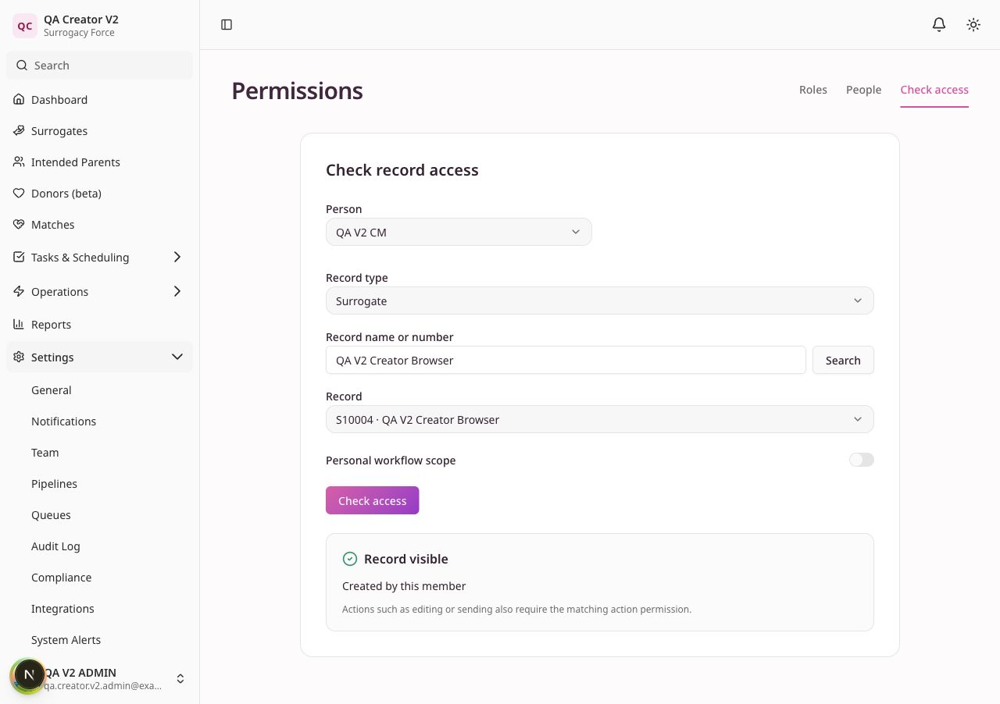

# Case Manager creator access and V2 migration readiness

Date: 2026-10-04

Implementation commit: `86c946aac` (`fix: preserve case manager access to created surrogates`).

## Result

ROLE-01 is fixed locally. In the same organization, Case Managers can access Approved-and-later surrogates and surrogates they created, including before approval and after reassignment. V1 and V2 apply the same creator exception.

V2 activation readiness for the target organization has not been established. No staging or production organization was inspected or activated. The implementation needs deployment before a target-environment preview can validate this exact behavior.

## Change

- Added the creator route to V1 detail/list/count checks, joined global search, and V2 centralized record scope.
- Preserved tenant, archive, membership, action permissions and V1 post-approval permissions. Assignment alone still does not grant pre-approval access under the default Case Manager scope.
- Kept personal workflow/campaign scope restricted to assignment or explicit collaboration. Creator visibility is additive to configured V2 role scope, including assigned-only or none.
- Added the readable access source, “Created by this member.”
- Included surrogate creator changes in the migration preview digest so a prior preview becomes stale when a creator changes.
- Kept donor and intended-parent behavior unchanged. No schema migration or historical creator backfill is required.

[Policy decision](../../docs/adr/0008-case-manager-created-surrogate-access.md).

## Verification

| Check | Result |
| --- | --- |
| Regression before implementation | 3 failures: create-then-open denied under V1/V2; creator changes did not invalidate preview digest. Existing owner-change case passed. |
| Initial focused backend | 42 passed. |
| Final affected backend suites | 162 passed, including permission policy, record scopes, surrogate access, interview appointments and match work. |
| Full backend, initial run | 5,604 passed, 3 failed, 503 subtests passed. Two denial fixtures had creator access after the approved policy change; their local creators were cleared while all assertions remained. The third failure is the existing calendar test-state leak. |
| Full backend, final run | 5,606 passed, 1 failed, 503 subtests passed in 360.04 seconds. Only the previously diagnosed scheduling test-state leak remains: `test_preparation_does_not_apply_google_cancellation_or_fire_workflows` raises `MultipleResultsFound`. |
| Full frontend check | Type checks, ESLint, 385 test files and 3,042 tests passed. |
| Ruff | All eight changed Python files passed lint and formatting. |
| React Doctor 0.9.14 | No issues in the two changed frontend files. |
| Independent review | No actionable findings in the implementation or access boundaries. |

The API lifecycle regression exercises creation, reopening, reassignment, list/search/count agreement, denial of another creator's pre-approval record, cross-organization denial, edit-permission denial and archive denial under both policy versions. Service tests cover SQL/detail/explanation parity, aliased queries, inactive membership, personal scope and custom role scope. The migration test runs the real preview and activation services in a disposable database and confirms creator access survives V1-to-V2 activation with no scope gain or loss for that fixture.

Existing tests continue to own CSRF and approval invariants. The two adjusted denial tests isolate collaboration revocation and archived match stage visibility from the newly approved creator grant; no assertions were removed.

## Browser checks

The real local API and frontend used a fresh disposable PostgreSQL database with separate synthetic V1 and V2 organizations. Sessions used the guarded development-login flow. Workers were not started and non-loopback outbound calls were blocked.

| Flow | V1 | V2 |
| --- | --- | --- |
| Other creator's Approved record is visible | Passed | Passed |
| Other creator's pre-approval record assigned to the Case Manager stays hidden | Passed | Passed |
| Create a New Unread surrogate and open its detail | Passed | Passed |
| Refresh detail | Passed | Passed |
| Created record appears in list and global search | Passed | Passed |
| Reopen created record from list | Creation automatically opened detail; refresh passed | Passed |
| Creator source displayed in Check access | V2 administration only | Passed |
| Personal workflow scope rejects unassigned creator-only record | V2 administration only | Passed |
| Changing personal scope clears the previous result | V2 administration only | Passed |
| Browser console warnings/errors | None observed | None observed |

Reassignment, foreign-tenant, archive and action-permission denials were verified by the API tests rather than repeated manually. This follow-up does not replace the original comprehensive QA ledger.

Server diagnostics recorded 199 requests and no 5xx responses. They also recorded 28 dashboard/analytics GET 401s and one workflow-metrics POST 400. Their initiating tab/session and causes were not retained, so these are unresolved diagnostics; they cannot be attributed to the verified creator flows or dismissed as expected session switching. The inspected browser tab's warning/error console remained empty.

[V1 detail](browser/v1-created-detail.jpg) · [V1 search](browser/v1-search.jpg) · [V2 detail](browser/v2-created-detail.jpg) · [V2 list](browser/v2-list.jpg) · [V2 search](browser/v2-search.jpg) · [Personal-scope denial](browser/v2-personal-scope-denied.jpg)

## Conditions before V2 activation

1. Deploy the reviewed implementation to the target environment, then generate a fresh organization-specific preview. Local synthetic fixtures cannot establish the target organization's readiness.
2. Review action-permission gains/losses and record-scope gains/losses separately. Resolve legacy individual revokes explicitly; converting a revoke to a role denial affects every member of that role.
3. Resolve historical handoff and legacy pool access decisions and missing approval gates reported by migration review. Confirm any retained collaborator access is intentional.
4. Review active organization workflows, pending executions and scheduled/sending campaigns. Pausing them can disable workflows and cancel pending work; no such decisions were applied here.
5. Activate only with the final reviewed configuration and its fresh digest, with explicit activation authorization. The server rejects stale or incomplete previews.

The remaining ROLE-02/ROLE-03 UI permission issues also occur under V2; switching policy does not resolve them. The original audit still has 14 unresolved product findings plus the [calendar test-isolation failure](../live-qa-20261004/test-analysis.md).

## Cleanup and delivery

The API (PID 34148), frontend (PIDs 33824/33816) and launchers exited. Ports 3000 and 8000 have no listeners. The disposable browser database and private harness/cache were removed. The browser QA tab was closed. Existing PostgreSQL containers remain running.

The repository test runner created, migrated and dropped a unique database for each backend invocation. An exact-name database check confirmed all five backend test databases and the browser database were absent after cleanup. Temporary PostgreSQL command wrappers, test caches, diagnostics and raw logs were removed; the sanitized report and synthetic screenshots remain.

Full backend validation is not green because of the unrelated, previously reproduced test-isolation failure; the permission and linked-record suites pass.

No push, PR, deployment or production activation is part of this change.
